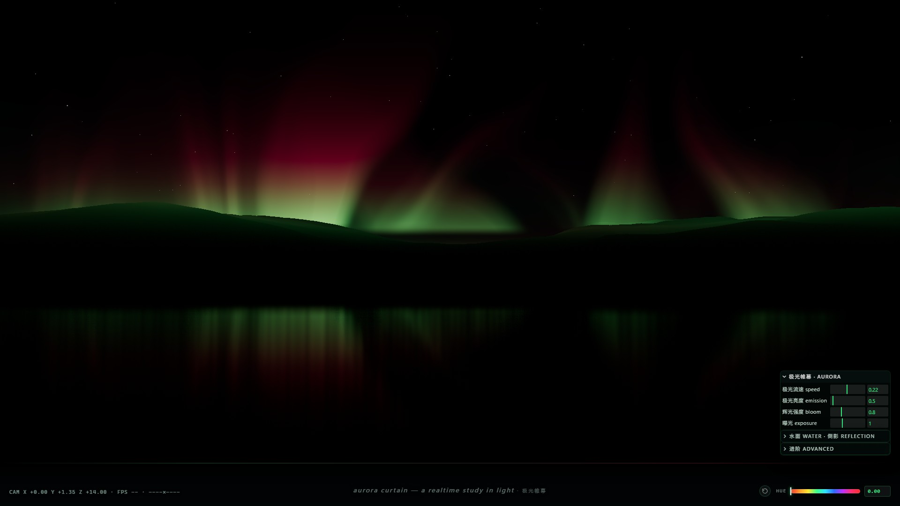
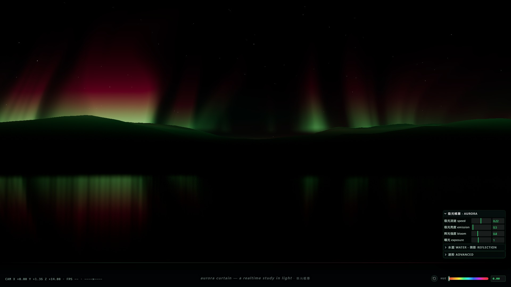
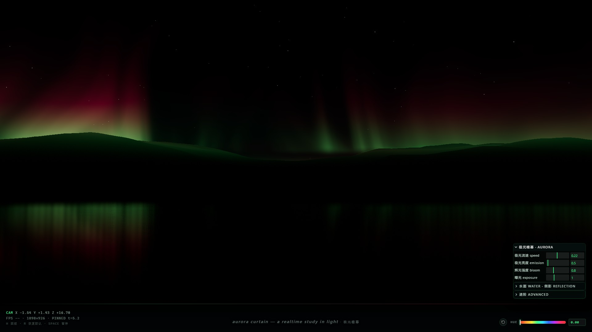
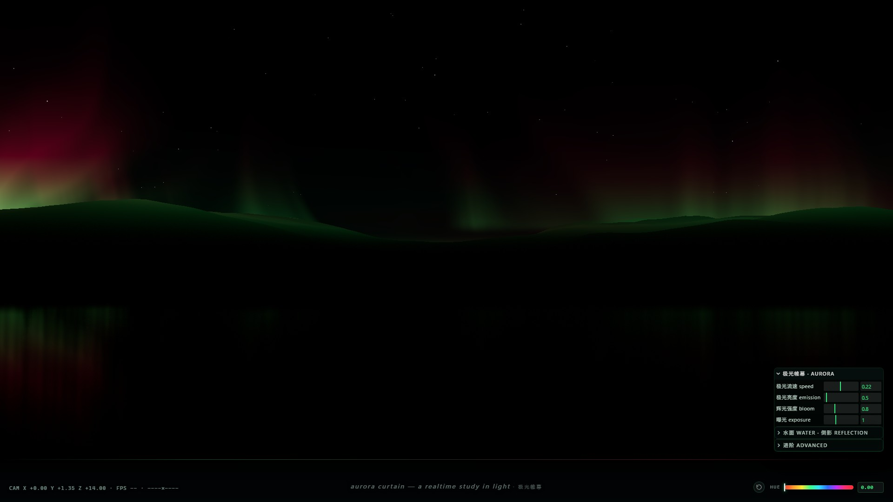

<div align="center">

# 极光帷幕 · AURORA CURTAIN

**单文件实时极光水面 · three.js + 自定义 GLSL · 断网双击即可运行**

[](https://threejs.org/)
[](https://d-onexxx.github.io/aurora/aurora-curtain.html)
[](https://developer.mozilla.org/docs/Web/API/WebGL_API)


[](LICENSE)



<sub>`aurora-curtain.html?t=0.8` 实机截图 · 1920×1080 · 无后期合成，浏览器原生渲染</sub>

</div>

---

## 目录

- [这是什么](#这是什么)
- [特性](#特性)
- [预览](#预览)
- [快速开始](#快速开始)
- [操作与快捷键](#操作与快捷键)
- [图层与渲染顺序](#图层与渲染顺序)
- [技术要点](#技术要点)
- [目录结构](#目录结构)
- [参数速查](#参数速查)
- [重新构建](#重新构建)
- [性能](#性能)
- [实现说明文档](#实现说明文档)
- [许可](#许可)

## 这是什么

一个**跑在浏览器里的实时极光场景**：夜空中多条垂直极光帘幕，绿色下边缘渐变到品红拖尾，
近黑色的山脉剪影挡在帘幕前，脚下是一面近乎静止、却把极光撕成碎条的湖。

整件作品是**一个 HTML 文件**（约 940 KB）：three.js r160、后期处理 addons、lil-gui 全部内联，
没有任何外链。双击打开、断网可用、也可以直接丢进 `file://` 或任意静态服务器。

画面里的东西**没有一样是贴图或模型资产**：极光、星空、山脉、水面波纹法线、
天穹渐变全部在运行时程序化生成（GLSL 噪声 / 自实现值噪声 / 整数频率正弦叠加）。
因此整份作品只有源码，没有二进制素材。

## 特性

- **单文件交付** — three.js + addons + lil-gui 内联，无 CDN、无网络请求、无构建步骤即可运行
- **全程序化** — 极光帘幕（3 阶 fbm 值噪声 + 域扭曲）、星空、山脉高度场、水面法线贴图，零素材
- **七层合成** — 星空 → 山脉 → 极光(加性) → 水面 → 倒影(Screen) → Bloom → HUD，顺序与混合模式逐层可控
- **真实镜像倒影** — 用 `scale.y = -1` 的几何镜像 + 法线扰动 UV + 逐片元距离衰减，
  不依赖 `Reflector` / `CubeCamera`，成本远低于实时平面反射
- **自发光主导的光影** — 无三点布光：水面与山脊由倒影层、山脊自发光染色与 Bloom 间接照亮
- **可调面板** — lil-gui 四个常驻滑块 + 彩虹色谱条（色相偏移）+ 一键恢复默认（小箭头 / `R`）
- **确定性** — 画面内容不含 `Math.random()` 生成项：星空与水面波纹用固定种子 LCG，
  噪声是纯哈希函数，同一台机器上重复打开画面稳定
- **时间相位开关** — `?t=<秒>` 把动画停在指定时刻，方便截图与取帧

## 预览

| 帘幕铺展 | 帘幕收拢 |
|---|---|
|  |  |
| `?t=3.6` | `?t=5.2` |



<sub>`?t=7.0` · 极光减弱、星空开始显现</sub>

> 上图为浏览器渲染的原始帧（含画面内 HUD）。`docs/` 里 4 张为 1920×1080 静帧。

## 快速开始

**方式零：在线直接看**（GitHub Pages，无需下载）

```text
https://d-onexxx.github.io/aurora/aurora-curtain.html
```

**方式一：直接打开（推荐）**

```text
双击 aurora-curtain.html
```

无需服务器、无需联网、无需安装任何依赖。

**方式二：起一个本地静态服务器**（可选，行为完全一致）

```bash
python -m http.server 8080
# 然后访问 http://127.0.0.1:8080/aurora-curtain.html
```

**取某一刻的静帧**

```text
aurora-curtain.html?t=5.2                    # 本地：时间相位停在第 5.2 秒并暂停
https://d-onexxx.github.io/aurora/aurora-curtain.html?t=5.2   # 在线同理，HUD 显示 PINNED t=5.2
```

## 操作与快捷键

| 操作 | 说明 |
|---|---|
| `H` | 显示 / 隐藏 HUD 与调试面板 |
| `R` | **恢复默认参数**（等同点击右下角旋转箭头） |
| `空格` | 暂停 / 继续时间 |
| 鼠标拖动滑块 | 实时调节流速、亮度、辉光、曝光、倒影等 |
| 彩虹色谱条 | 拖动游标旋转整体色相（0–1），右侧数值框可直接输入 |
| `?t=<秒>` | 固定时间相位（截图 / 取帧用） |

## 图层与渲染顺序


| # | 图层 | 实现 | 混合 | `renderOrder` |
|---|---|---|---|---|
| 1 | 天穹 | `SphereGeometry(1800)` 内壁渐变 Shader | Normal | −100 |
| 2 | 星空 | `Points` 800 点，`size 0.05`、`opacity 0.6`、固定种子 LCG | Additive | −90 |
| 3 | 山脉 | `PlaneGeometry(3600×900, 420×190)` 顶点噪声位移，`#0A0E0A`、`roughness 1.0` | Normal | −10 |
| 4 | 极光帷幕 | 双层平面（`z = −820 / −1250`），自定义 GLSL | **Additive** | 10 |
| 5 | 水面 | 水平 `Plane`，`#05080A`、`roughness 0.15`、`metalness 0.0`、滚动 normalMap | Normal | 20 |
| 6 | 水面倒影 | 同一份 shader 的镜像副本 + 法线扰动 + 距离衰减 | **Screen** | 30 |
| 7 | 后期 | `UnrealBloomPass` → `OutputPass` | — | — |
| 8 | HUD | 底部控制条 + lil-gui 面板（DOM 叠加） | Normal | — |

## 技术要点

### 1. 极光帘幕

- **垂直拉伸**：噪声在 `v` 方向用极低频率（`0.20 / 0.42 / 0.25 / 0.10`），
  在 `u` 方向用高频（`8.0 / 16.0 / 26.0 / 34.0`），于是得到竖向帘纹而不是云团。
- **三阶 fbm**：自实现值噪声（五次平滑 + 双线性）+ 3 阶叠加（lacunarity 2.03、gain 0.5）。
- **域扭曲**：两级低频噪声偏移采样坐标，让帘幕整体左右摆动。
- **暗隙**：`gap` 项把低噪值压掉，切出多条独立帘幕与它们之间的黑缝。
- **配色**：`mix(#39FF8A, #FF2D6F, f(噪声值, 世界高度))` —— 底部荧光绿、顶部品红拖尾，
  底部再叠一条绿色亮核（真实极光的亮绿下边缘）。
- **羽化**：全部由**世界高度**驱动（底缘 smoothstep + 向上指数拖尾 + 贴地羽化），
  而不是 `uv`，这样帘幕底边能被山脊自然挡住，不会出现一条硬切的直线。

```glsl
float low  = smoothstep(uLowY, uLowY + uLowFade, yA);      // 贴地羽化
float edge = smoothstep(uBandY - 24.0, uBandY + 2.0, yA);  // 底缘
float tail = exp(-max(0.0, yA - uBandY) / uBandW);         // 向上拖尾
float vmask = low * (edge * tail + haze * 0.03);
float alpha = min(body * vmask * xf * hf, 1.0);            // 必须 clamp 到 1
```

### 2. 水面波纹（程序化法线贴图）

512×512 的 `DataTexture`，由 **22 条整数频率正弦**叠加求导得到法线，保证可无缝平铺：

```js
cyc = max(2, round(3 * 1.34 ** (i % 11)))      // 每条的周期数
ang = PI/2 + (rand() - 0.5) * 0.62             // 波矢主要沿 v → 屏幕上呈横向条带
kx = round(cos(ang) * cyc);  kv = round(sin(ang) * cyc) || cyc
amp = 1 / 1.30 ** i                            // 幅度衰减
// 法线 = normalize(-dhdu * 0.010, -dhdv * 0.010, 1)
```

贴图 `repeat 4×4`、各向异性拉满，每帧滚动 `offset.y += 0.08 * dt`。

### 3. 山脉高度场

`PlaneGeometry(3600×900, 420×190)` 绕 X 轴 **−90°** 躺平后平移 `z = −410`，
逐顶点用 ridged 噪声位移（`ramp = smoothstep(150, 430, dist)` 让近处沉入水下），
再按 `|x|` 压低中间形成峡谷走廊。材质 `#0A0E0A`、`roughness 1.0`（无高光），
用 `onBeforeCompile` 往 `totalEmissiveRadiance` 里注入山脊染色
（`pow(hn, 2.4) * 0.09`，随高度衰减）——**是自发光项，不是灯光**。

### 4. 水面倒影

不用 `Reflector` / `CubeCamera`。把同一份极光 shader 再挂一份到 `scale.y = -1` 的镜像组里，
几何本身就是关于水面的真实镜像，然后：

- 只保留水面以下的片元：`if (vWorld.y > -0.02) discard;`
- 用同一张滚动 normalMap 扰动 UV：`uv += nrm.xy * uRipple;`
- 按“水深”分条随机横移，把镜像打碎；
- 距离衰减取**视线与水面交点**到相机的水平距离（逐片元求解，不是顶点插值）：
  `fade = 1 - clamp(dist / 30, 0, 1)`；
- 混合用 **预乘颜色 + Screen**（`OneMinusDstColorFactor / OneFactor`），比普通加性更通透。

### 5. 后期

`EffectComposer → RenderPass → UnrealBloomPass(threshold 0.6 / strength 0.8 / radius 0.4) → OutputPass`。
色彩空间统一 sRGB，输出前过 **ACESFilmicToneMapping**（exposure 1.0）。
`composer.setSize()` 内部会按 `pixelRatio` 同步各 pass 尺寸，不要再单独调 `bloomPass.setSize()`。

### 6. 光影策略：为什么方向光强度是 0

低粗糙度（0.15）水面 + 任何可观的平行光 ⇒ GGX 镜面峰值约 `1/(π·α²) ≈ 14 倍`，
画面里会出现一条贯穿地平线的“探照灯”白色光柱，与“自发光主导”的质感完全冲突。
因此这里只给一个微弱半球环境光，水面与山脊靠**倒影层 + 山脊自发光染色 + Bloom**间接照亮。

## 目录结构

```text
aurora/
├─ aurora-curtain.html     ← 成品：单文件，双击即看（~940 KB）
├─ PROMPT.md               ← 参数与实现说明（完整提示词 / 真实数值表 / 翻车点 / 自检清单）
├─ README.md
├─ LICENSE                 ← MIT
├─ docs/
│  └─ preview-01..04.jpg   ← 1920×1080 实机静帧
├─ src/
│  ├─ app.js               ← 场景与着色器（~830 行）
│  └─ shell.html           ← HTML / CSS / HUD 外壳
├─ build.ps1               ← Windows 打包（调用 esbuild 原生二进制）
└─ build.mjs               ← Node 打包（esbuild JS API，环境允许时可用）
```

## 参数速查

| 项 | 值 |
|---|---|
| 极光主色 → 顶部色 | `#39FF8A` → `#FF2D6F` |
| 极光流速 / 发光强度 | `0.22` / `0.50` |
| 水面 基色 / roughness / metalness | `#05080A` / `0.15` / `0.0` |
| 波纹 normalMap | tile `4×4`，滚动 `0.08` |
| 倒影 强度 / 衰减 / 扰动 / 混合 | `0.75` / `30` / `0.07` / Screen |
| 星空 数量 / 尺寸 / 不透明度 | `800` / `0.05` / `0.6`（种子 `20240930`） |
| 山脉 颜色 / roughness / 山脊染色 | `#0A0E0A` / `1.0` / `0.09` |
| 天穹 天顶 / 地平线 / 辉光 | `#000104` / `#04090E` / `0.16` |
| 后期 Bloom | threshold `0.6` · strength `0.8` · radius `0.4` |
| 色调映射 / 曝光 | ACESFilmic / `1.0` |
| 相机 位置 / FOV | `(0, 1.35, 14)` / `55°` |
| 运镜周期 | `8.0 s`（dolly + pan，ease-in-out） |
| 环境光 / 方向光 | 半球 `0.30` / **`0.0`** |

完整数值表（含每一项的源码行号）见 [PROMPT.md](PROMPT.md) 的 C 段。

## 重新构建

修改 `src/` 后重新打包成单文件：

```powershell
# 1) 准备打包依赖（只需一次；运行作品本身不需要任何依赖）
mkdir .build ; cd .build
npm init -y
npm i three@0.160.0 esbuild
cd ..

# 2) 打包
powershell -NoProfile -ExecutionPolicy Bypass -File .\build.ps1
#   → 输出 aurora-curtain.html
```

`build.ps1` 直接调用 esbuild 原生二进制，
读取 `src/app.js` 打包为 IIFE，再把 `src/shell.html` 里的占位符 `/*__APP_BUNDLE__*/`
替换成打包结果，写回单文件。

## 性能

| 环境 | 分辨率 | 帧率 |
|---|---|---|
| Chromium + SwiftShader（**纯软件光栅**） | 1920×1080 | ≈ 47 FPS |
| 任意独显 / 集显（硬件 WebGL2） | 1920×1080 | 60 FPS（vsync 上限） |

`setPixelRatio` 上限 2；Bloom 与主渲染在 resize 时同步；几何量极小
（两张 1×1 段帘幕平面 + 一块高度场 + 800 点星空），开销集中在片元着色器。

## 实现说明文档

[PROMPT.md](PROMPT.md) 是从这个成品源码里逐行取值写成的实现说明：

| 段 | 内容 |
|---|---|
| A | 完整提示词 —— 可以把整段交给 AI 智能体，按同一套参数把作品重做一遍 |
| B | 生图参考提示词（质感与构图参考） |
| C | **真实数值速查表**，每项标注源码行号，可回查 |
| D | 7 个翻车点（症状 → 病因） |
| E | 自检清单与 `?t=` 截图开关 |

## 许可

[MIT](LICENSE) © 2026 Dai Yihao
